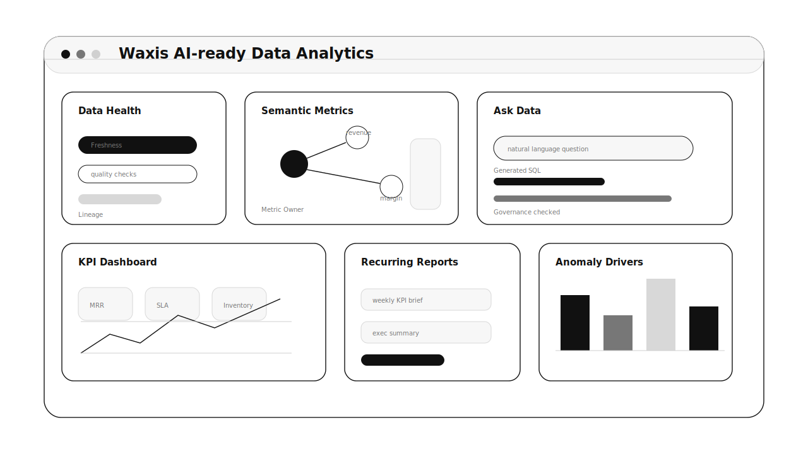
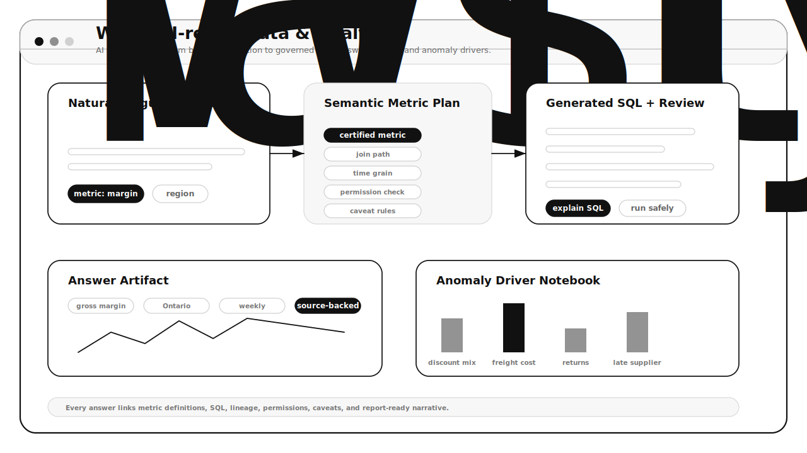
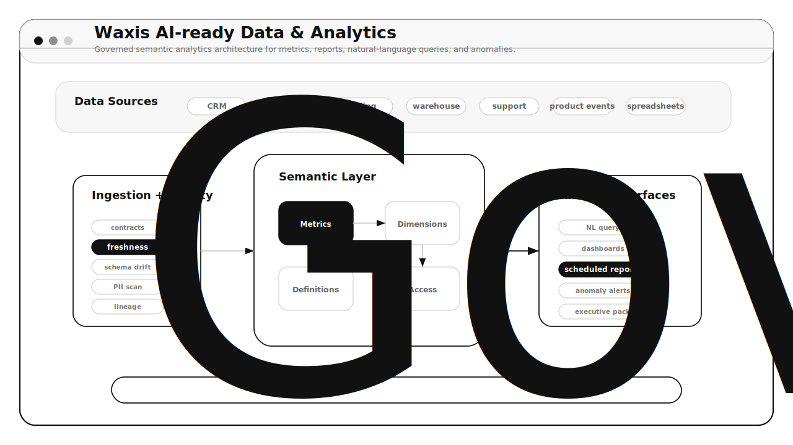

# Waxis AI-ready Data & Analytics

Governed analytics software for data ingestion, semantic metrics, natural-language questions, recurring reports, anomaly alerts, and source-backed business decisions.

## Product Preview

## What It Is

Waxis AI-ready Data & Analytics turns fragmented business data into trusted metrics and AI-assisted analysis. It connects source systems, prepares canonical datasets, defines business metrics once, and lets teams ask questions or receive reports without losing governance.

The product is not just text-to-SQL. It is a semantic analytics layer where natural-language answers are grounded in approved metrics, verified queries, permissions, and data freshness.

## What Users See

The main workspace helps business users understand performance without waiting for custom analyst work.

Users can see:

- Data freshness and source health
- Certified metrics with definitions and owners
- Natural-language questions translated into governed queries
- KPI dashboards, charts, and result tables
- Recurring reports with narrative summaries and caveats
- Anomaly alerts with likely drivers
- Query audit, SQL preview, and analyst review when needed

## Core Product Screens

- Data Health: ingestion jobs, freshness, row counts, schema changes, and quality tests
- Semantic Metrics: definitions, formulas, dimensions, owners, synonyms, and approved examples
- Ask Data: natural-language question, generated SQL, result table, chart, caveats, and feedback
- KPI Dashboard: business metrics by time, segment, region, product, customer, or workflow
- Report Builder: scheduled summaries with source-backed narratives and charts
- Anomaly Center: unusual metric changes, likely drivers, owners, and follow-up actions
- Governance Console: permissions, audit logs, certified datasets, and retention policy

## A Typical Workflow

1. Data sources sync into approved datasets.
2. Analysts define metrics, dimensions, relationships, synonyms, and verified SQL examples.
3. A business user asks a question in a scoped workspace.
4. The system resolves the metric, asks clarifying questions if needed, and generates safe SQL.
5. The user sees the result, chart, calculation explanation, caveats, and freshness status.
6. Reports and anomaly alerts turn repeated analysis into operating rhythm.

## Who It Is For

- Business leaders who need fast, trusted KPI answers
- Analysts who want reusable metric definitions and less repeated reporting
- Data engineers responsible for freshness, quality, and lineage
- Operations teams watching daily performance and anomalies
- Finance and RevOps teams standardizing metrics across departments

## MVP Shape

The first version should feel like a governed analytics workspace: users can ask questions in plain language, but every answer is tied to certified datasets, approved metrics, visible SQL, freshness, permissions, and caveats.

## Product Requirements

The complete product requirements document is here:

- [PRD.md](./PRD.md)

## Research Basis

This repo uses a June 2026 research snapshot across official semantic-layer, conversational analytics, BI Copilot, governance, and AI safety sources, including Snowflake Cortex Analyst, Databricks Genie, Power BI Copilot, dbt Semantic Layer, NIST AI RMF, OWASP LLM Top 10, and MCP.
